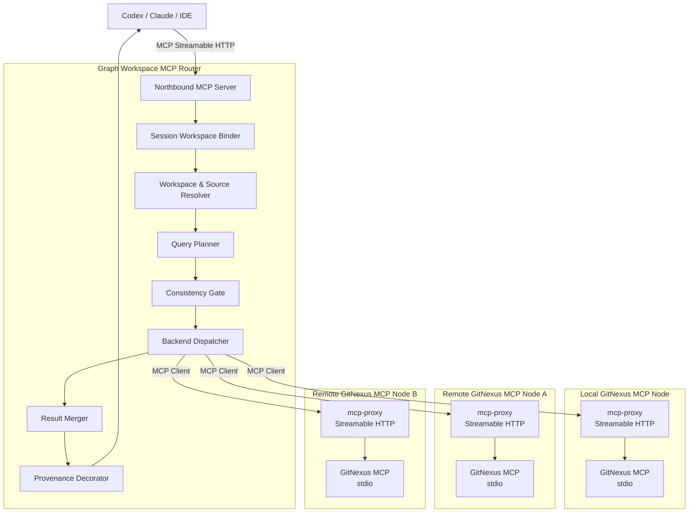
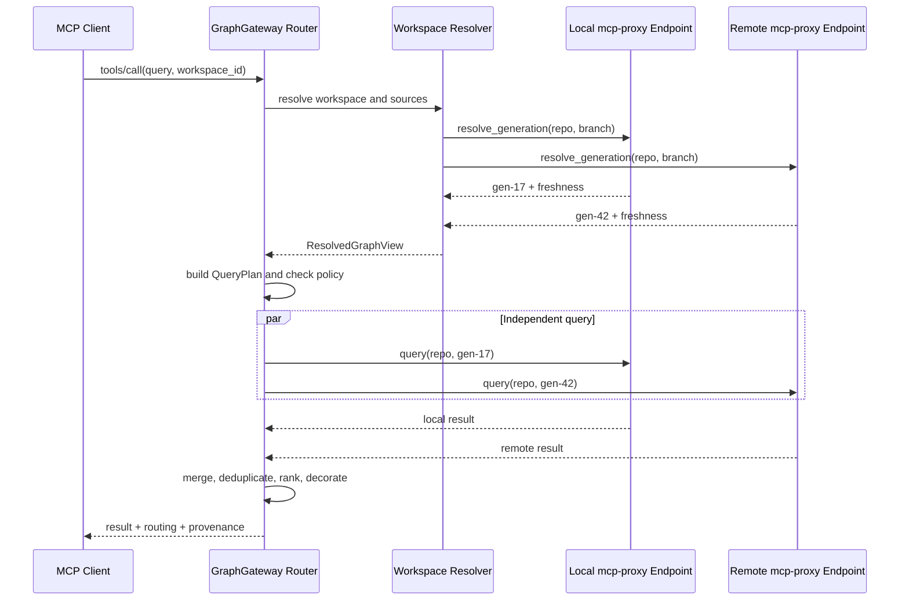

# Graph Workspace MCP Router 设计

> 状态：设计草案
> 优先级：分支级图谱优先；PR、任意 Commit 快照暂缓
> 目标模块：GraphGateway

## 1. 背景

代码图谱需要同时覆盖以下四种使用模式：

1. 需求设计：使用一个或多个历史分支图谱，只读且要求版本精确。
2. 单仓开发：本地图谱增量更新频繁，对实时性要求较高。
3. 上游依赖开发：本地项目持续更新，同时查询固定版本的上游依赖图谱。
4. 微服务协作：多个 consumer、provider 仓库共同参与，需要跨仓查询和较高实时性。

如果将 Workspace、分支解析、远程调用、跨仓聚合等逻辑直接加入 GitNexus
本地查询后端，会使索引核心、MCP 传输和协作策略互相耦合。为降低改动风险，
本设计引入独立的 **Graph Workspace MCP Router**。

该模块同时扮演两个角色：

- 北向是 MCP Server，为 Codex、Claude、IDE 等客户端提供统一工具。
- 南向是 MCP Client，通过 MCP Streamable HTTP 调用本地或远程 GitNexus MCP 节点。

GitNexus 保留现有 stdio MCP Server，由成熟、可替换的第三方 mcp-proxy 将其适配为
Streamable HTTP endpoint。对 GraphGateway 而言，`mcp-proxy + GitNexus stdio MCP`
共同构成一个逻辑 GitNexus MCP Node。

本地和远程节点使用相同协议与能力模型，区别只体现在地址、认证、延迟和权限上。

## 2. 设计目标

### 2.1 目标

- 对 AI 客户端隐藏本地、远程、单仓、多仓差异。
- 以 Graph Workspace 作为一次任务的查询上下文。
- 将分支解析为不可变 `generation_id` 后再执行查询。
- 支持单源、扇出、基线对比和跨仓影响分析。
- 保证结果携带仓库、分支、generation 和节点来源。
- 将写操作限制在 Workspace 的本地 `primary` Source。
- 允许路由模块与 GitNexus 节点分别部署、分别升级。
- 复用 GitNexus 现有 stdio MCP，避免在 GitNexus 内重复实现 HTTP Transport。
- 保持对具体 mcp-proxy 产品无依赖，允许独立替换代理实现。
- 复用 GitNexus 已有 `query`、`context`、`impact`、Group 等能力。

### 2.2 非目标

- 不在 Router 中解析代码或创建图谱。
- 不复制、同步或者物理合并图数据库。
- 不通过 MCP 传输完整图谱数据。
- 第一阶段不实现 PR 图谱和任意 Commit 图谱。
- 第一阶段不允许修改远程、依赖或基线 Source。
- 不要求所有查询都广播到 Workspace 的所有成员。
- 不要求 GitNexus 第一阶段原生实现 Streamable HTTP Transport。

## 3. 核心概念

### 3.1 Graph Source

Graph Source 表示一个可查询的代码图谱来源：

```json
{
  "source_id": "payment-local",
  "repo_id": "payment-service",
  "branch": "feature/refund",
  "role": "primary",
  "location": "local",
  "endpoint": "http://127.0.0.1:38471/mcp",
  "transport": "streamable-http",
  "adapter": "mcp-proxy",
  "writable": true
}
```

`role` 可取：

- `primary`：当前开发主图谱。
- `baseline`：用于对比的基线图谱。
- `dependency`：固定版本的上游依赖图谱。
- `member`：微服务 Workspace 成员图谱。

### 3.2 Generation

分支本身是可移动引用，不能作为一次查询的稳定版本。节点需要将：

```text
repo_id + branch
```

解析为：

```text
repo_id + branch + generation_id + head_sha
```

`generation_id` 是节点内部生成的不可变图谱版本标识。Router 在执行查询前冻结本次
使用的 generation，后续的扇出、重试和聚合均使用该版本。

### 3.3 Graph Workspace

Graph Workspace 是一次需求、开发或协作任务的逻辑查询上下文，包含：

- Source 集合。
- Source 角色。
- 一致性策略。
- 主 Source。
- 依赖绑定。
- Group 拓扑引用。
- 写权限策略。
- 最大允许陈旧时间。

Workspace 不等同于本地工作目录，也不拥有代码文件。

### 3.4 Resolved Graph View

Resolved Graph View 是 Workspace 在某个时刻解析出的稳定视图：

```json
{
  "view_id": "view-20260724-001",
  "workspace_id": "payment-feature",
  "members": [
    {
      "source_id": "payment-local",
      "repo_id": "payment-service",
      "branch": "feature/refund",
      "generation_id": "gen-17",
      "head_sha": "abc123"
    },
    {
      "source_id": "account-remote",
      "repo_id": "account-service",
      "branch": "main",
      "generation_id": "gen-42",
      "head_sha": "def456"
    }
  ]
}
```

一条查询的全部结果必须引用同一个 `view_id`。微服务 eventual 模式允许某个成员
暂时不可用，但必须在视图和响应中明确标记。

## 4. 总体架构



### 4.1 Router 负责

- Workspace 配置、激活和解析。
- Source endpoint 注册和健康状态。
- MCP 下游能力协商。
- branch 到 generation 的解析。
- QueryPlan 生成。
- 一致性、陈旧度和权限检查。
- 下游会话池、超时、重试和熔断。
- 查询扇出和定向跨仓追踪。
- 结果去重、排序、聚合和来源装饰。
- 审计与可观测性。

### 4.2 GitNexus stdio MCP 负责

- 仓库、分支和 generation 管理。
- 增量或全量索引。
- 实际执行图谱查询工具。
- 单仓符号消歧和图遍历。
- 返回 generation 状态与 freshness。
- 提供 Group 合约、拓扑或跨仓关系数据。

### 4.3 mcp-proxy 负责

- 在 Streamable HTTP 与 stdio MCP 之间进行透明协议适配。
- 建立、维护和回收下游 MCP Session。
- 启动、监控和终止 GitNexus stdio 子进程。
- 处理 HTTP 连接、流式响应、超时和基础健康检查。
- 透传 tools、resources、prompts、通知和能力协商。
- 提供认证接入点，或者部署在认证反向代理之后。

mcp-proxy 只负责传输适配，不负责 Workspace、generation 解析、查询规划、结果聚合
或权限策略。

### 4.4 Router 不直接处理

- LadybugDB 或其他图数据库文件。
- Parser、语言解析和索引流水线。
- 工作区源码修改。
- 图谱文件的跨机器同步。

## 5. MCP 接口分层

### 5.1 北向 MCP

Router 对 AI 客户端提供稳定的 Workspace 化工具：

```text
query
context
impact
trace
check
explain
pdg_query
cypher
detect_changes
rename
workspace_list
workspace_activate
workspace_status
workspace_resolve
```

北向接口不暴露节点网络地址和认证信息。

建议提供以下 Router 资源：

```text
graphgateway://workspaces
graphgateway://workspace/{id}/context
graphgateway://workspace/{id}/sources
graphgateway://workspace/{id}/status
graphgateway://workspace/{id}/view
```

### 5.2 南向 MCP

本地和远程 GitNexus stdio MCP 通过各自的 mcp-proxy 暴露相同的 Streamable HTTP
MCP endpoint。GraphGateway 只依赖标准 MCP，不依赖代理实现的私有 API：

```text
list_repos
list_branches
resolve_generation
generation_status
query
context
impact
trace
check
explain
pdg_query
cypher
detect_changes
rename
```

建议提供以下节点资源：

```text
gitnexus://repo/{repo}/context
gitnexus://repo/{repo}/branches
gitnexus://repo/{repo}/branch/{branch}/status
gitnexus://repo/{repo}/generation/{generation}/status
gitnexus://group/{group}/contracts
gitnexus://group/{group}/status
```

不是所有节点都必须实现全部能力。mcp-proxy 必须透明传递能力协商；Router 在
初始化阶段保存能力快照，并根据
QueryPlan 判断目标节点是否满足请求。

## 6. 请求模型

保留 GitNexus 已有工具名称，在参数中增加可选的统一路由上下文：

```json
{
  "query": "支付失败后的补偿逻辑",
  "workspace_id": "payment-feature",
  "source": {
    "repo_id": "payment-service",
    "role": "primary"
  },
  "routing": {
    "intent": "auto",
    "consistency": "workspace-default",
    "wait_policy": "use-last-complete"
  }
}
```

`intent` 可取：

- `auto`
- `single-source`
- `workspace-search`
- `baseline-compare`
- `dependency-trace`
- `cross-repo-impact`

`wait_policy` 可取：

- `wait`：等待新的 generation 完成。
- `use-last-complete`：使用最近完成的 generation。
- `reject`：不满足实时性时拒绝查询。

Router 可以在 MCP 会话中绑定默认 `workspace_id`，但每次调用仍允许显式覆盖，
以支持同一客户端并发处理多个 Workspace。

## 7. QueryPlan

Router 先生成执行计划，再调用下游节点：

```ts
interface QueryPlan {
  planId: string;
  workspaceId: string;
  viewId: string;
  tool: string;

  executionMode:
    | "single"
    | "fanout"
    | "compare"
    | "cross-repo";

  targets: Array<{
    sourceId: string;
    repoId: string;
    branch: string;
    generationId: string;
    backend: "local" | "remote";
    role: "primary" | "baseline" | "dependency" | "member";
  }>;

  consistency: "exact" | "near-real-time" | "eventual";
  mergeStrategy?: "none" | "rrf" | "compare" | "graph-path";
  allowPartial: boolean;
}
```

QueryPlan 是路由和审计的核心对象。模式差异在计划生成阶段处理，不应散落到每个
工具的实现中。

## 8. 请求分发流程



具体步骤：

1. 读取请求显式 `workspace_id` 或会话默认值。
2. 加载 Workspace、Source 和权限策略。
3. 对 Source 进行能力、认证和健康检查。
4. 将各分支解析为不可变 generation。
5. 构造 Resolved Graph View。
6. 根据工具和意图选择查询目标。
7. 执行一致性和陈旧度门禁。
8. 创建 QueryPlan。
9. 对互不依赖的请求并行执行。
10. 合并、去重并排序。
11. 附加路由信息、版本向量和警告。

图中的 mcp-proxy endpoint 会将每次 MCP 调用透明转发给对应的 GitNexus stdio MCP。
Router 不直接感知 stdio 子进程。

## 9. 工具分发规则

| MCP 工具 | 默认方式 | 分发规则 |
|---|---|---|
| `query` | 可扇出 | Workspace 搜索时向目标 Source 并行查询，使用 RRF 合并 |
| `context` | 单 Source | 先确定符号所属仓库，多个匹配时返回候选 |
| `impact` | 单源起点，可跨仓 | 先执行仓内影响，再通过依赖或 Group Bridge 定向扩展 |
| `trace` | 单 Source 或显式跨仓 | 默认不广播 |
| `explain` | 单 Source | 依赖目标 generation 的 PDG/taint 能力 |
| `pdg_query` | 单 Source | 数据流和控制流不跨 generation 自动合并 |
| `cypher` | 单 Source | 禁止向多个数据库自动广播任意 Cypher |
| `detect_changes` | 本地 primary | 不得访问远程、基线或依赖 Source |
| `rename` | 本地 primary | Router 和节点均需校验写权限 |
| Workspace 资源 | Workspace 级 | 返回 Source、状态和 Resolved Graph View |

同名符号存在于多个显式 Source 时，不允许静默选择仓库。应返回
`SOURCE_AMBIGUOUS` 和候选列表。

## 10. 四种模式

### 10.1 需求设计

特点：

- 一个或多个固定 generation。
- 全部 Source 只读。
- 一致性为 `exact`。

路由策略：

```text
query
  ├─ historical branch A / generation-12
  ├─ historical branch B / generation-37
  └─ dependency C / generation-8
             ↓
          RRF 聚合
```

- `query` 可以对配置的 Source 扇出。
- `context` 定位单一 Source。
- `impact` 可以跨只读图谱分析。
- generation 缺失时失败，不切换到最新分支版本。
- `detect_changes` 和 `rename` 直接拒绝。

### 10.2 单仓开发

特点：

- 本地 `primary` 高频增量更新。
- 可选远程 `baseline`。
- 一致性为 `near-real-time`。

路由策略：

```text
普通查询                  → local primary
显式 baseline-compare    → local primary + baseline
detect_changes / rename  → local primary
```

同仓优先级：

```text
local dirty generation
  > local clean branch generation
  > remote same branch active generation
  > remote default branch active generation
```

索引正在构建时，可以根据 Workspace 策略等待或使用最近完成 generation。普通查询
不得自动混入 baseline。

### 10.3 上游依赖开发

特点：

- 本地项目持续更新。
- 上游依赖固定为一个 generation。
- 只有本地 `primary` 可写。

依赖绑定示例：

```json
{
  "consumer": "payment-service",
  "package": "com.example:account-sdk",
  "provider_source": "account-sdk-main",
  "generation_id": "gen-42"
}
```

路由策略：

```text
查询本地实现      → local primary
查询上游能力      → upstream dependency
跨依赖影响分析    → local → Dependency Binding → upstream
```

`impact` 使用两阶段执行：

1. 在本地识别调用点、依赖包和接口边界。
2. 根据 Dependency Binding 进入固定的上游 generation 继续分析。

多个上游 Source 同时匹配时返回歧义，不按仓库名称猜测。

### 10.4 微服务多仓协作

特点：

- 多个 consumer、provider、gateway 成员。
- 成员分支可以分别更新。
- 一致性为 `eventual`。
- 第一阶段只有 `primary` 可写。

路由策略：

```text
query
  ├─ consumer / feature-a / gen-17
  ├─ provider / feature-b / gen-23
  └─ gateway  / main      / gen-51
             │
             ▼
    Group Bridge / Contracts
             │
             ▼
     合并结果与成员级 provenance
```

- 明确指定服务时只查询对应成员。
- Workspace 搜索可以并行查询多个成员。
- `impact` 先分析起点服务，再通过 Group Bridge 定向查找相关 consumer/provider。
- 不应把所有影响分析请求从一开始就广播给全部成员。
- 允许部分成员陈旧或不可用，但响应必须标记降级和缺失成员。

Group Bridge 必须绑定版本向量：

```json
{
  "consumer": "gen-17",
  "provider": "gen-23",
  "gateway": "gen-51"
}
```

版本向量不匹配时，应重新生成 Bridge 或返回明确警告。

## 11. 一致性策略

### 11.1 exact

- 使用明确的 `generation_id`。
- 缺失或不可用即失败。
- 不允许自动回退到其他 generation。
- 适用于需求设计和固定依赖。

### 11.2 near-real-time

- 优先使用本地最新完成 generation。
- 可以配置最大允许陈旧时间。
- 超过限制后根据 `wait_policy` 等待或失败。
- 适用于单仓开发。

### 11.3 eventual

- 每个成员独立选择最新完成 generation。
- 允许部分结果。
- 必须返回成员级 freshness 和版本向量。
- 适用于微服务协作。

## 12. 响应模型

所有 Router 工具统一附加路由信息：

```json
{
  "data": {},
  "routing": {
    "workspace_id": "payment-feature",
    "view_id": "view-20260724-001",
    "plan_id": "plan-9281",
    "mode": "cross-repo",
    "consistency": "eventual",
    "degraded": false
  },
  "provenance": [
    {
      "source_id": "payment-local",
      "repo_id": "payment-service",
      "branch": "feature/refund",
      "generation_id": "gen-17",
      "head_sha": "abc123",
      "backend": "local",
      "freshness_ms": 1200
    }
  ],
  "warnings": []
}
```

合并后的每一个 process、symbol 或 impact path 也应保留自己的 `source_id`，不能只在
响应顶层记录 Source 集合。

## 13. MCP 会话管理

MCP Streamable HTTP 可能在初始化后返回 `Mcp-Session-Id`。Router 必须分别维护
北向会话和每个南向节点会话：

```text
Upstream Session A
  ├─ workspace_id
  ├─ resolved_view_id
  ├─ Downstream Local Session L1
  ├─ Downstream Remote Session R1
  └─ Downstream Remote Session R2
```

规则：

- 不向下游透传北向 `Mcp-Session-Id`。
- 每个 endpoint 独立初始化和协商能力。
- 下游会话失效时重新初始化。
- QueryPlan 使用 `source_id` 查找对应会话。
- 会话恢复后必须确认 capability snapshot 是否变化。

mcp-proxy 还需要负责 HTTP Session 与 stdio 子进程之间的映射。该映射不能由
GraphGateway 假定，选型和部署时必须明确以下模型：

- 一个 HTTP Session 启动一个独立 GitNexus stdio 进程。
- 多个 HTTP Session 共享一个长期运行的 GitNexus stdio 进程。
- 使用有限大小的 GitNexus stdio 进程池。

如果共享进程，需要验证并发请求和图数据库访问安全；如果每个 Session 独占进程，
需要评估启动延迟、内存占用和断开后的进程回收。

## 14. 能力协商

节点可能运行不同版本：

```json
{
  "source_id": "provider",
  "capabilities": {
    "query": "1.2",
    "impact": "1.1",
    "pdg_query": null,
    "branch_generation": "1.0"
  }
}
```

Router 对外暴露自己能够保证的稳定工具契约。执行前检查所有目标节点：

- 全部支持：正常执行。
- 可安全缩小目标范围：执行并返回警告。
- 必需能力缺失：返回 `CAPABILITY_UNAVAILABLE`。
- 工具定义变化：刷新能力缓存和 Workspace 状态。

## 15. 安全边界

### 15.1 北向认证

- 识别用户、IDE 或自动化任务身份。
- 校验用户是否有权访问 Workspace。
- 将用户权限映射为可查询 Source 和可调用工具。

### 15.2 南向认证

- Router 为每个远程 Source 使用独立凭据。
- 不将北向 Authorization Header 无条件透传到下游。
- 认证信息使用外部 Secret Provider，只保存引用。
- 认证可以由 mcp-proxy 提供，也可以由其前置反向代理提供。
- mcp-proxy 不得将认证信息写入 GitNexus stdio 或普通日志。

### 15.3 mcp-proxy Endpoint 安全

- 本地 mcp-proxy 默认只监听 `127.0.0.1`。
- 远程 mcp-proxy endpoint 必须使用 HTTPS。
- 校验 HTTP `Origin`。
- Source endpoint 必须来自允许列表，防止 SSRF。
- 限制重定向目标。
- 对远程节点配置请求大小、响应大小和超时上限。
- GitNexus 的 MCP stdout 只能输出协议消息，代理日志必须与 stdout 隔离。

### 15.4 写操作

写操作必须同时通过 Router 和 GitNexus 节点校验：

```text
primary + local + writable  → 允许
baseline                    → 拒绝
dependency                  → 拒绝
remote member               → 第一阶段拒绝
design workspace            → 全部拒绝
```

## 16. 错误模型

建议使用稳定错误码：

| 错误码 | 含义 |
|---|---|
| `WORKSPACE_NOT_FOUND` | Workspace 不存在 |
| `SOURCE_NOT_FOUND` | 指定 Source 不存在 |
| `SOURCE_AMBIGUOUS` | 多个 Source 同时匹配 |
| `GENERATION_NOT_READY` | generation 尚未完成 |
| `EXACT_SOURCE_MISSING` | exact 模式所需版本不存在 |
| `STALE_LIMIT_EXCEEDED` | 超出允许陈旧时间 |
| `CAPABILITY_UNAVAILABLE` | 目标节点缺少工具能力 |
| `WRITE_SCOPE_DENIED` | 写操作超出本地 primary |
| `BRIDGE_VERSION_MISMATCH` | Group Bridge 与成员版本不一致 |
| `DOWNSTREAM_UNAVAILABLE` | 下游 MCP 节点不可用 |
| `PARTIAL_RESULT` | 返回了可用的部分结果 |

`PARTIAL_RESULT` 应作为携带数据的降级状态，而不是简单抛弃所有成功结果。

## 17. 可用性与性能

### 17.1 并行

互不依赖的 `query` 请求可以并行。跨仓 `impact` 通常存在前后依赖，应先识别边界，
再定向调用目标成员。

### 17.2 超时预算

将北向总超时拆分为：

- Workspace 解析预算。
- generation 解析预算。
- 下游执行预算。
- 聚合预算。

QueryPlan 中应记录截止时间，避免每层分别使用完整超时造成总时间失控。

### 17.3 重试

- 只重试可安全重放的只读工具。
- `rename` 等写工具默认不自动重试。
- exact generation 请求可以重试，但不能切换 generation。
- 限制单节点和全局重试次数。

### 17.4 熔断

连续失败的节点进入短期熔断：

- exact 模式：失败。
- eventual 模式：返回部分结果并标记节点不可用。
- 恢复探测成功后重新加入路由。

## 18. 可观测性

每次调用生成 `plan_id` 和分布式 trace：

```text
northbound request
  └─ workspace resolve
  └─ generation resolve
  ├─ downstream call: local
  ├─ downstream call: provider
  └─ merge and decorate
```

建议记录：

- Workspace、view 和 plan。
- 工具名称与查询意图。
- 实际访问 Source。
- generation 和 head SHA。
- 每个下游调用耗时。
- 缓存、重试和熔断状态。
- 部分失败和降级原因。
- 写操作审计。

日志中不得记录访问令牌或未经裁剪的敏感源码。

## 19. 部署形态

GraphGateway 的 Windows 独立 EXE、Tauri 管理产品、REST/CLI 集成、Owned Sidecar
生命周期和发布方式，参见
[GraphGateway Windows 与 Tauri Product 设计](./graphgateway-windows-tauri-product-design.zh-CN.md)。

### 19.1 本地开发

```text
GraphGateway Desktop / IDE
  → Local GraphGateway Router (Owned Sidecar)
      → Local mcp-proxy → GitNexus stdio MCP
      → Remote mcp-proxy → Baseline GitNexus stdio MCP
```

Router 和本地 mcp-proxy 都监听 loopback，远程节点通过 HTTPS 访问。GitNexus stdio
MCP 不单独监听网络端口。当前产品 MVP 由 Tauri Product 负责启动、监控和停止本地
GraphGateway Sidecar；Shared Service 与 Remote 产品连接模式暂缓。

### 19.2 团队内网

```text
Developer IDE
  → Local or Team GraphGateway Router
      → Developer mcp-proxy → Local GitNexus stdio MCP
      → Team mcp-proxy → Remote GitNexus stdio MCP
```

如果团队 Router 无法访问开发者 loopback，本地节点需要通过安全隧道或开发者本机
Router 参与查询，不应直接暴露到公共网络。

### 19.3 服务端

```text
AI Platform
  → Server GraphGateway Router Cluster
      → mcp-proxy A → GitNexus stdio MCP A
      → mcp-proxy B → GitNexus stdio MCP B
      → mcp-proxy C → GitNexus stdio MCP C
```

Router 实例应尽量无状态。Workspace 配置、会话信息、Source 健康状态可以存入共享
控制面；下游 MCP 会话由实例管理并允许重建。

## 20. mcp-proxy 适配与 GitNexus 改造边界

### 20.1 已接受的传输决策

GitNexus 第一阶段不原生实现 Streamable HTTP Transport，而是继续提供现有 stdio
MCP Server。成熟的第三方 mcp-proxy 负责将 stdio MCP 适配为 Streamable HTTP：

```text
GraphGateway
    │
    │ MCP Streamable HTTP
    ▼
mcp-proxy
    │
    │ MCP stdio
    ▼
GitNexus MCP Server
    │
    ▼
Code Graph
```

GraphGateway 只依赖标准 MCP endpoint。具体 mcp-proxy 产品是部署配置，不进入
Workspace、Source 或 QueryPlan 的业务模型。

### 20.2 三方职责边界

GraphGateway 负责：

- Workspace、Source 和 endpoint 注册。
- endpoint 与 generation 的稳定绑定。
- 查询规划、扇出、跨仓聚合和一致性。
- provenance、写权限和远程凭据。
- generation 蓝绿切换和旧实例回收决策。

mcp-proxy 负责：

- Streamable HTTP 与 stdio 的协议适配。
- MCP Session 映射。
- GitNexus 子进程生命周期。
- HTTP 连接、流式响应和传输层超时。
- 能力、工具、资源和通知的透明传递。
- 可选的认证接入和健康检查。

GitNexus 负责：

- 保留现有 stdio MCP Server。
- 执行代码索引和图谱查询。
- 保留 LocalBackend、GroupService 和现有工具语义。
- 在现有结果不足时补充最小的 status 和 provenance 能力。

mcp-proxy 不能替代 branch/generation 解析、权限策略、来源追踪或跨仓查询聚合。

### 20.3 MVP 节点模型：一实例一 Source/generation

第一阶段推荐让一个逻辑 MCP Node 对应一个明确的 Source/generation：

```text
payment-service / feature-refund / gen-17
    └─ mcp-proxy :38117
        └─ GitNexus stdio MCP
            └─ immutable graph directory
```

对应 Source：

```json
{
  "source_id": "payment-feature-gen17",
  "repo_id": "payment-service",
  "branch": "feature/refund",
  "generation_id": "gen-17",
  "head_sha": "abc123",
  "endpoint": "http://127.0.0.1:38117/mcp",
  "adapter": "mcp-proxy"
}
```

该模型的优点：

- GitNexus 工具第一阶段无需增加统一的 `generation_id` 参数。
- endpoint 天然绑定不可变版本。
- 旧 generation 可以继续为在途查询提供只读服务。
- 本地、基线、依赖和微服务成员使用相同 Source 模型。

代价：

- generation 较多时会增加进程和 endpoint 数量。
- 需要 Node Manager 控制启动、健康检查、闲置回收和端口分配。
- 需要限制同时驻留的历史 generation 数量。

### 20.4 后续节点模型：共享多 generation

规模扩大后，可以让一个 GitNexus MCP 实例管理多个 generation：

```text
mcp-proxy
    └─ GitNexus stdio MCP
        ├─ feature-refund / gen-17
        ├─ feature-refund / gen-18
        └─ main / gen-42
```

此时 GitNexus 工具必须显式接受：

```json
{
  "repo": "payment-service",
  "branch": "feature/refund",
  "generation_id": "gen-17"
}
```

共享模型可以减少进程和连接数量，但需要修改 GitNexus 的工具参数、仓库解析和存储
选择逻辑。因此它不是第一阶段的前置条件。

### 20.5 本地高频更新的蓝绿切换

单仓开发需要避免查询读到正在构建的半成品图谱：

```text
当前查询
    → endpoint A → GitNexus instance A / gen-17

后台构建
    → endpoint B → GitNexus instance B / gen-18

gen-18 ready
    → GraphGateway 原子切换 Source active endpoint 到 B
    → A 等待在途请求完成后回收
```

切换规则：

1. 新 generation 完成索引和健康检查。
2. GraphGateway 创建新的 Resolved Graph View。
3. 新查询路由到新 endpoint。
4. 旧 View 的在途查询继续使用旧 endpoint。
5. 引用计数归零并超过保留期后，回收旧 proxy 和 GitNexus 进程。

### 20.6 mcp-proxy 选型检查

候选代理至少需要验证：

- 支持 MCP Streamable HTTP，而不只是旧 HTTP+SSE。
- 正确完成初始化、能力协商和 `Mcp-Session-Id`。
- 支持多个并发 HTTP Session。
- 明确 Session 到 stdio 进程的映射模型。
- 子进程异常退出后能够恢复或返回稳定错误。
- 客户端断开后能够回收 Session 和子进程。
- 透明传递 tools、resources、prompts 和通知。
- 支持请求超时、响应大小限制和健康检查。
- 支持或兼容 `Origin` 校验、HTTPS 和外部认证代理。
- 代理日志不污染 GitNexus MCP stdout。
- 提供 stderr、退出码、请求 trace 和基础指标。

选型时必须对以下两种压力场景进行验证：

1. 多个 HTTP 客户端共享一个 GitNexus stdio 进程时的并发安全。
2. 每个 Session 独占 GitNexus 进程时的启动延迟和内存占用。

## 21. 推荐工程结构

以下结构描述 Router 内部职责分层，不代表完整的 Windows/Tauri 产品仓库结构。完整
产品结构和 Rust Cargo Workspace 划分参见
[GraphGateway Windows 与 Tauri Product 设计](./graphgateway-windows-tauri-product-design.zh-CN.md)。

```text
GraphGateway/
├─ docs/
├─ src/
│  ├─ transport/
│  │  ├─ northbound-server/
│  │  └─ downstream-client/
│  ├─ nodes/
│  │  ├─ endpoint-registry/
│  │  ├─ capability-registry/
│  │  └─ lifecycle-manager/
│  ├─ workspace/
│  │  ├─ workspace-registry/
│  │  ├─ source-resolver/
│  │  └─ resolved-view/
│  ├─ routing/
│  │  ├─ query-classifier/
│  │  ├─ query-planner/
│  │  ├─ consistency-gate/
│  │  └─ backend-dispatcher/
│  ├─ aggregation/
│  │  ├─ rrf-merger/
│  │  ├─ symbol-deduplicator/
│  │  ├─ impact-merger/
│  │  └─ provenance-decorator/
│  ├─ security/
│  │  ├─ endpoint-policy/
│  │  ├─ credential-provider/
│  │  └─ write-policy/
│  └─ observability/
│     ├─ tracing/
│     ├─ metrics/
│     └─ audit-log/
└─ test/
```

## 22. 分阶段实施

### 阶段一：单源与分支视图

- GraphGateway 北向 MCP Streamable HTTP。
- 选定并验证 mcp-proxy。
- 通过 mcp-proxy 将 GitNexus stdio MCP 暴露为 Streamable HTTP。
- 采用一实例一 Source/generation 节点模型。
- 实现 proxy 和 GitNexus stdio 子进程的生命周期管理。
- Source 注册与能力协商。
- Workspace 会话绑定。
- branch 到 generation 解析。
- `query`、`context`、`impact` 单源路由。
- 响应 provenance。
- 本地 primary 写权限。
- 本地 generation 蓝绿切换。

### 阶段二：多源查询

- `query` 并行扇出。
- RRF 排序和符号去重。
- baseline 显式对比。
- 超时、重试、熔断和部分结果。
- dependency binding。

### 阶段三：微服务协作

- Group Bridge 接入。
- 跨仓 impact 定向追踪。
- 版本向量校验。
- eventual 一致性和成员 freshness。
- 团队级权限和审计。

### 后续阶段

- PR 图谱 Source Resolver。
- 任意 Commit 图谱 Source Resolver。
- 评估共享多 generation GitNexus MCP 节点。
- 更细粒度的远程写入授权。
- 基于查询统计的智能路由和缓存。

PR 和 Commit 只扩展 Source Resolver 与 generation 解析，不应改变 QueryPlan 和 MCP
分发的核心模型。

## 23. 关键决策

1. GraphGateway 是独立模块，不嵌入 GitNexus LocalBackend。
2. 北向和南向统一使用 MCP，HTTP 传输采用 Streamable HTTP。
3. GitNexus 保留 stdio MCP，由可替换的 mcp-proxy 暴露 Streamable HTTP。
4. GraphGateway 不依赖具体 mcp-proxy 产品或私有 API。
5. Router 北向是 MCP Server，南向是多个相互隔离的 MCP Client。
6. 本地和远程节点遵循同一工具契约。
7. 第一阶段采用 endpoint 与 Source/generation 一对一绑定。
8. 本地高频更新使用 generation 蓝绿切换，不查询构建中的图谱。
9. Workspace 决定可用图谱，QueryPlan 决定单次调用实际访问的图谱。
10. 跨仓联合查询使用分发与聚合，不物理合并图数据库。
11. 分支必须解析为不可变 generation 后执行。
12. 普通查询不自动混入 baseline。
13. 写操作仅允许本地 primary。
14. 所有结果必须提供成员级 provenance 和版本向量。
