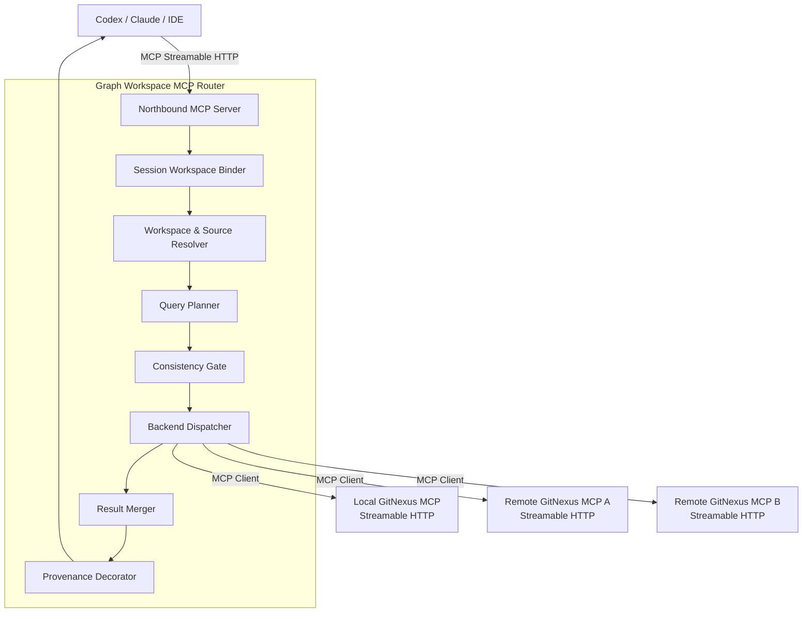
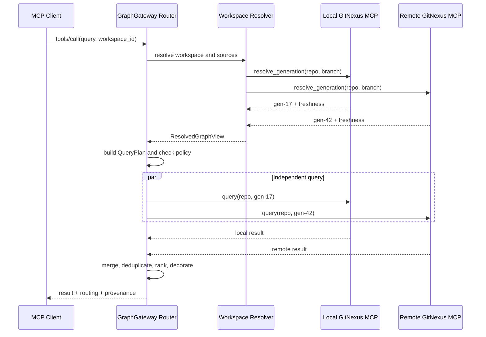

# Graph Workspace MCP Router 设计

> 状态：设计草案
> 优先级：分支级图谱优先；PR、任意 Commit 快照暂缓
> 目标模块：GraphGateway

## 1. 背景

代码图谱需要同时覆盖以下四种使用模式：

1. 需求设计：使用一个或多个历史分支图谱，只读且要求版本精确。
2. 单仓开发：本地图谱增量更新频繁，对实时性要求较高。
3. 上游依赖开发：本地项目持续更新，同时查询固定版本的上游依赖图谱。
4. 微服务协作：多个 consumer、provider 仓库共同参与，需要跨仓查询和较高实时性。

如果将 Workspace、分支解析、远程调用、跨仓聚合等逻辑直接加入 GitNexus
本地查询后端，会使索引核心、MCP 传输和协作策略互相耦合。为降低改动风险，
本设计引入独立的 **Graph Workspace MCP Router**。

该模块同时扮演两个角色：

- 北向是 MCP Server，为 Codex、Claude、IDE 等客户端提供统一工具。
- 南向是 MCP Client，通过 MCP Streamable HTTP 调用本地或远程 GitNexus MCP 节点。

本地和远程节点使用相同协议与能力模型，区别只体现在地址、认证、延迟和权限上。

## 2. 设计目标

### 2.1 目标

- 对 AI 客户端隐藏本地、远程、单仓、多仓差异。
- 以 Graph Workspace 作为一次任务的查询上下文。
- 将分支解析为不可变 `generation_id` 后再执行查询。
- 支持单源、扇出、基线对比和跨仓影响分析。
- 保证结果携带仓库、分支、generation 和节点来源。
- 将写操作限制在 Workspace 的本地 `primary` Source。
- 允许路由模块与 GitNexus 节点分别部署、分别升级。
- 复用 GitNexus 已有 `query`、`context`、`impact`、Group 等能力。

### 2.2 非目标

- 不在 Router 中解析代码或创建图谱。
- 不复制、同步或者物理合并图数据库。
- 不通过 MCP 传输完整图谱数据。
- 第一阶段不实现 PR 图谱和任意 Commit 图谱。
- 第一阶段不允许修改远程、依赖或基线 Source。
- 不要求所有查询都广播到 Workspace 的所有成员。

## 3. 核心概念

### 3.1 Graph Source

Graph Source 表示一个可查询的代码图谱来源：

```json
{
  "source_id": "payment-local",
  "repo_id": "payment-service",
  "branch": "feature/refund",
  "role": "primary",
  "location": "local",
  "endpoint": "http://127.0.0.1:38471/mcp",
  "transport": "streamable-http",
  "writable": true
}
```

`role` 可取：

- `primary`：当前开发主图谱。
- `baseline`：用于对比的基线图谱。
- `dependency`：固定版本的上游依赖图谱。
- `member`：微服务 Workspace 成员图谱。

### 3.2 Generation

分支本身是可移动引用，不能作为一次查询的稳定版本。节点需要将：

```text
repo_id + branch
```

解析为：

```text
repo_id + branch + generation_id + head_sha
```

`generation_id` 是节点内部生成的不可变图谱版本标识。Router 在执行查询前冻结本次
使用的 generation，后续的扇出、重试和聚合均使用该版本。

### 3.3 Graph Workspace

Graph Workspace 是一次需求、开发或协作任务的逻辑查询上下文，包含：

- Source 集合。
- Source 角色。
- 一致性策略。
- 主 Source。
- 依赖绑定。
- Group 拓扑引用。
- 写权限策略。
- 最大允许陈旧时间。

Workspace 不等同于本地工作目录，也不拥有代码文件。

### 3.4 Resolved Graph View

Resolved Graph View 是 Workspace 在某个时刻解析出的稳定视图：

```json
{
  "view_id": "view-20260724-001",
  "workspace_id": "payment-feature",
  "members": [
    {
      "source_id": "payment-local",
      "repo_id": "payment-service",
      "branch": "feature/refund",
      "generation_id": "gen-17",
      "head_sha": "abc123"
    },
    {
      "source_id": "account-remote",
      "repo_id": "account-service",
      "branch": "main",
      "generation_id": "gen-42",
      "head_sha": "def456"
    }
  ]
}
```

一条查询的全部结果必须引用同一个 `view_id`。微服务 eventual 模式允许某个成员
暂时不可用，但必须在视图和响应中明确标记。

## 4. 总体架构



### 4.1 Router 负责

- Workspace 配置、激活和解析。
- Source endpoint 注册和健康状态。
- MCP 下游能力协商。
- branch 到 generation 的解析。
- QueryPlan 生成。
- 一致性、陈旧度和权限检查。
- 下游会话池、超时、重试和熔断。
- 查询扇出和定向跨仓追踪。
- 结果去重、排序、聚合和来源装饰。
- 审计与可观测性。

### 4.2 GitNexus MCP 节点负责

- 仓库、分支和 generation 管理。
- 增量或全量索引。
- 实际执行图谱查询工具。
- 单仓符号消歧和图遍历。
- 返回 generation 状态与 freshness。
- 提供 Group 合约、拓扑或跨仓关系数据。

### 4.3 Router 不直接处理

- LadybugDB 或其他图数据库文件。
- Parser、语言解析和索引流水线。
- 工作区源码修改。
- 图谱文件的跨机器同步。

## 5. MCP 接口分层

### 5.1 北向 MCP

Router 对 AI 客户端提供稳定的 Workspace 化工具：

```text
query
context
impact
trace
check
explain
pdg_query
cypher
detect_changes
rename
workspace_list
workspace_activate
workspace_status
workspace_resolve
```

北向接口不暴露节点网络地址和认证信息。

建议提供以下 Router 资源：

```text
graphgateway://workspaces
graphgateway://workspace/{id}/context
graphgateway://workspace/{id}/sources
graphgateway://workspace/{id}/status
graphgateway://workspace/{id}/view
```

### 5.2 南向 MCP

本地和远程 GitNexus 节点通过相同的 Streamable HTTP MCP endpoint 提供：

```text
list_repos
list_branches
resolve_generation
generation_status
query
context
impact
trace
check
explain
pdg_query
cypher
detect_changes
rename
```

建议提供以下节点资源：

```text
gitnexus://repo/{repo}/context
gitnexus://repo/{repo}/branches
gitnexus://repo/{repo}/branch/{branch}/status
gitnexus://repo/{repo}/generation/{generation}/status
gitnexus://group/{group}/contracts
gitnexus://group/{group}/status
```

不是所有节点都必须实现全部能力。Router 在初始化阶段保存能力快照，并根据
QueryPlan 判断目标节点是否满足请求。

## 6. 请求模型

保留 GitNexus 已有工具名称，在参数中增加可选的统一路由上下文：

```json
{
  "query": "支付失败后的补偿逻辑",
  "workspace_id": "payment-feature",
  "source": {
    "repo_id": "payment-service",
    "role": "primary"
  },
  "routing": {
    "intent": "auto",
    "consistency": "workspace-default",
    "wait_policy": "use-last-complete"
  }
}
```

`intent` 可取：

- `auto`
- `single-source`
- `workspace-search`
- `baseline-compare`
- `dependency-trace`
- `cross-repo-impact`

`wait_policy` 可取：

- `wait`：等待新的 generation 完成。
- `use-last-complete`：使用最近完成的 generation。
- `reject`：不满足实时性时拒绝查询。

Router 可以在 MCP 会话中绑定默认 `workspace_id`，但每次调用仍允许显式覆盖，
以支持同一客户端并发处理多个 Workspace。

## 7. QueryPlan

Router 先生成执行计划，再调用下游节点：

```ts
interface QueryPlan {
  planId: string;
  workspaceId: string;
  viewId: string;
  tool: string;

  executionMode:
    | "single"
    | "fanout"
    | "compare"
    | "cross-repo";

  targets: Array<{
    sourceId: string;
    repoId: string;
    branch: string;
    generationId: string;
    backend: "local" | "remote";
    role: "primary" | "baseline" | "dependency" | "member";
  }>;

  consistency: "exact" | "near-real-time" | "eventual";
  mergeStrategy?: "none" | "rrf" | "compare" | "graph-path";
  allowPartial: boolean;
}
```

QueryPlan 是路由和审计的核心对象。模式差异在计划生成阶段处理，不应散落到每个
工具的实现中。

## 8. 请求分发流程



具体步骤：

1. 读取请求显式 `workspace_id` 或会话默认值。
2. 加载 Workspace、Source 和权限策略。
3. 对 Source 进行能力、认证和健康检查。
4. 将各分支解析为不可变 generation。
5. 构造 Resolved Graph View。
6. 根据工具和意图选择查询目标。
7. 执行一致性和陈旧度门禁。
8. 创建 QueryPlan。
9. 对互不依赖的请求并行执行。
10. 合并、去重并排序。
11. 附加路由信息、版本向量和警告。

## 9. 工具分发规则

| MCP 工具 | 默认方式 | 分发规则 |
|---|---|---|
| `query` | 可扇出 | Workspace 搜索时向目标 Source 并行查询，使用 RRF 合并 |
| `context` | 单 Source | 先确定符号所属仓库，多个匹配时返回候选 |
| `impact` | 单源起点，可跨仓 | 先执行仓内影响，再通过依赖或 Group Bridge 定向扩展 |
| `trace` | 单 Source 或显式跨仓 | 默认不广播 |
| `explain` | 单 Source | 依赖目标 generation 的 PDG/taint 能力 |
| `pdg_query` | 单 Source | 数据流和控制流不跨 generation 自动合并 |
| `cypher` | 单 Source | 禁止向多个数据库自动广播任意 Cypher |
| `detect_changes` | 本地 primary | 不得访问远程、基线或依赖 Source |
| `rename` | 本地 primary | Router 和节点均需校验写权限 |
| Workspace 资源 | Workspace 级 | 返回 Source、状态和 Resolved Graph View |

同名符号存在于多个显式 Source 时，不允许静默选择仓库。应返回
`SOURCE_AMBIGUOUS` 和候选列表。

## 10. 四种模式

### 10.1 需求设计

特点：

- 一个或多个固定 generation。
- 全部 Source 只读。
- 一致性为 `exact`。

路由策略：

```text
query
  ├─ historical branch A / generation-12
  ├─ historical branch B / generation-37
  └─ dependency C / generation-8
             ↓
          RRF 聚合
```

- `query` 可以对配置的 Source 扇出。
- `context` 定位单一 Source。
- `impact` 可以跨只读图谱分析。
- generation 缺失时失败，不切换到最新分支版本。
- `detect_changes` 和 `rename` 直接拒绝。

### 10.2 单仓开发

特点：

- 本地 `primary` 高频增量更新。
- 可选远程 `baseline`。
- 一致性为 `near-real-time`。

路由策略：

```text
普通查询                  → local primary
显式 baseline-compare    → local primary + baseline
detect_changes / rename  → local primary
```

同仓优先级：

```text
local dirty generation
  > local clean branch generation
  > remote same branch active generation
  > remote default branch active generation
```

索引正在构建时，可以根据 Workspace 策略等待或使用最近完成 generation。普通查询
不得自动混入 baseline。

### 10.3 上游依赖开发

特点：

- 本地项目持续更新。
- 上游依赖固定为一个 generation。
- 只有本地 `primary` 可写。

依赖绑定示例：

```json
{
  "consumer": "payment-service",
  "package": "com.example:account-sdk",
  "provider_source": "account-sdk-main",
  "generation_id": "gen-42"
}
```

路由策略：

```text
查询本地实现      → local primary
查询上游能力      → upstream dependency
跨依赖影响分析    → local → Dependency Binding → upstream
```

`impact` 使用两阶段执行：

1. 在本地识别调用点、依赖包和接口边界。
2. 根据 Dependency Binding 进入固定的上游 generation 继续分析。

多个上游 Source 同时匹配时返回歧义，不按仓库名称猜测。

### 10.4 微服务多仓协作

特点：

- 多个 consumer、provider、gateway 成员。
- 成员分支可以分别更新。
- 一致性为 `eventual`。
- 第一阶段只有 `primary` 可写。

路由策略：

```text
query
  ├─ consumer / feature-a / gen-17
  ├─ provider / feature-b / gen-23
  └─ gateway  / main      / gen-51
             │
             ▼
    Group Bridge / Contracts
             │
             ▼
     合并结果与成员级 provenance
```

- 明确指定服务时只查询对应成员。
- Workspace 搜索可以并行查询多个成员。
- `impact` 先分析起点服务，再通过 Group Bridge 定向查找相关 consumer/provider。
- 不应把所有影响分析请求从一开始就广播给全部成员。
- 允许部分成员陈旧或不可用，但响应必须标记降级和缺失成员。

Group Bridge 必须绑定版本向量：

```json
{
  "consumer": "gen-17",
  "provider": "gen-23",
  "gateway": "gen-51"
}
```

版本向量不匹配时，应重新生成 Bridge 或返回明确警告。

## 11. 一致性策略

### 11.1 exact

- 使用明确的 `generation_id`。
- 缺失或不可用即失败。
- 不允许自动回退到其他 generation。
- 适用于需求设计和固定依赖。

### 11.2 near-real-time

- 优先使用本地最新完成 generation。
- 可以配置最大允许陈旧时间。
- 超过限制后根据 `wait_policy` 等待或失败。
- 适用于单仓开发。

### 11.3 eventual

- 每个成员独立选择最新完成 generation。
- 允许部分结果。
- 必须返回成员级 freshness 和版本向量。
- 适用于微服务协作。

## 12. 响应模型

所有 Router 工具统一附加路由信息：

```json
{
  "data": {},
  "routing": {
    "workspace_id": "payment-feature",
    "view_id": "view-20260724-001",
    "plan_id": "plan-9281",
    "mode": "cross-repo",
    "consistency": "eventual",
    "degraded": false
  },
  "provenance": [
    {
      "source_id": "payment-local",
      "repo_id": "payment-service",
      "branch": "feature/refund",
      "generation_id": "gen-17",
      "head_sha": "abc123",
      "backend": "local",
      "freshness_ms": 1200
    }
  ],
  "warnings": []
}
```

合并后的每一个 process、symbol 或 impact path 也应保留自己的 `source_id`，不能只在
响应顶层记录 Source 集合。

## 13. MCP 会话管理

MCP Streamable HTTP 可能在初始化后返回 `Mcp-Session-Id`。Router 必须分别维护
北向会话和每个南向节点会话：

```text
Upstream Session A
  ├─ workspace_id
  ├─ resolved_view_id
  ├─ Downstream Local Session L1
  ├─ Downstream Remote Session R1
  └─ Downstream Remote Session R2
```

规则：

- 不向下游透传北向 `Mcp-Session-Id`。
- 每个 endpoint 独立初始化和协商能力。
- 下游会话失效时重新初始化。
- QueryPlan 使用 `source_id` 查找对应会话。
- 会话恢复后必须确认 capability snapshot 是否变化。

## 14. 能力协商

节点可能运行不同版本：

```json
{
  "source_id": "provider",
  "capabilities": {
    "query": "1.2",
    "impact": "1.1",
    "pdg_query": null,
    "branch_generation": "1.0"
  }
}
```

Router 对外暴露自己能够保证的稳定工具契约。执行前检查所有目标节点：

- 全部支持：正常执行。
- 可安全缩小目标范围：执行并返回警告。
- 必需能力缺失：返回 `CAPABILITY_UNAVAILABLE`。
- 工具定义变化：刷新能力缓存和 Workspace 状态。

## 15. 安全边界

### 15.1 北向认证

- 识别用户、IDE 或自动化任务身份。
- 校验用户是否有权访问 Workspace。
- 将用户权限映射为可查询 Source 和可调用工具。

### 15.2 南向认证

- Router 为每个远程 Source 使用独立凭据。
- 不将北向 Authorization Header 无条件透传到下游。
- 认证信息使用外部 Secret Provider，只保存引用。

### 15.3 Endpoint 安全

- 本地 MCP 默认只监听 `127.0.0.1`。
- 远程 MCP 必须使用 HTTPS。
- 校验 HTTP `Origin`。
- Source endpoint 必须来自允许列表，防止 SSRF。
- 限制重定向目标。
- 对远程节点配置请求大小、响应大小和超时上限。

### 15.4 写操作

写操作必须同时通过 Router 和 GitNexus 节点校验：

```text
primary + local + writable  → 允许
baseline                    → 拒绝
dependency                  → 拒绝
remote member               → 第一阶段拒绝
design workspace            → 全部拒绝
```

## 16. 错误模型

建议使用稳定错误码：

| 错误码 | 含义 |
|---|---|
| `WORKSPACE_NOT_FOUND` | Workspace 不存在 |
| `SOURCE_NOT_FOUND` | 指定 Source 不存在 |
| `SOURCE_AMBIGUOUS` | 多个 Source 同时匹配 |
| `GENERATION_NOT_READY` | generation 尚未完成 |
| `EXACT_SOURCE_MISSING` | exact 模式所需版本不存在 |
| `STALE_LIMIT_EXCEEDED` | 超出允许陈旧时间 |
| `CAPABILITY_UNAVAILABLE` | 目标节点缺少工具能力 |
| `WRITE_SCOPE_DENIED` | 写操作超出本地 primary |
| `BRIDGE_VERSION_MISMATCH` | Group Bridge 与成员版本不一致 |
| `DOWNSTREAM_UNAVAILABLE` | 下游 MCP 节点不可用 |
| `PARTIAL_RESULT` | 返回了可用的部分结果 |

`PARTIAL_RESULT` 应作为携带数据的降级状态，而不是简单抛弃所有成功结果。

## 17. 可用性与性能

### 17.1 并行

互不依赖的 `query` 请求可以并行。跨仓 `impact` 通常存在前后依赖，应先识别边界，
再定向调用目标成员。

### 17.2 超时预算

将北向总超时拆分为：

- Workspace 解析预算。
- generation 解析预算。
- 下游执行预算。
- 聚合预算。

QueryPlan 中应记录截止时间，避免每层分别使用完整超时造成总时间失控。

### 17.3 重试

- 只重试可安全重放的只读工具。
- `rename` 等写工具默认不自动重试。
- exact generation 请求可以重试，但不能切换 generation。
- 限制单节点和全局重试次数。

### 17.4 熔断

连续失败的节点进入短期熔断：

- exact 模式：失败。
- eventual 模式：返回部分结果并标记节点不可用。
- 恢复探测成功后重新加入路由。

## 18. 可观测性

每次调用生成 `plan_id` 和分布式 trace：

```text
northbound request
  └─ workspace resolve
  └─ generation resolve
  ├─ downstream call: local
  ├─ downstream call: provider
  └─ merge and decorate
```

建议记录：

- Workspace、view 和 plan。
- 工具名称与查询意图。
- 实际访问 Source。
- generation 和 head SHA。
- 每个下游调用耗时。
- 缓存、重试和熔断状态。
- 部分失败和降级原因。
- 写操作审计。

日志中不得记录访问令牌或未经裁剪的敏感源码。

## 19. 部署形态

### 19.1 本地开发

```text
IDE
  → Local GraphGateway Router
      → Local GitNexus MCP
      → Remote Baseline MCP
```

Router 和本地 GitNexus 都监听 loopback，远程节点通过 HTTPS 访问。

### 19.2 团队内网

```text
Developer IDE
  → Local or Team GraphGateway Router
      → Developer Local GitNexus MCP
      → Team Remote GitNexus MCP
```

如果团队 Router 无法访问开发者 loopback，本地节点需要通过安全隧道或开发者本机
Router 参与查询，不应直接暴露到公共网络。

### 19.3 服务端

```text
AI Platform
  → Server GraphGateway Router Cluster
      → GitNexus MCP Node A
      → GitNexus MCP Node B
      → GitNexus MCP Node C
```

Router 实例应尽量无状态。Workspace 配置、会话信息、Source 健康状态可以存入共享
控制面；下游 MCP 会话由实例管理并允许重建。

## 20. 与 GitNexus 的改造边界

GitNexus 侧尽量限制为：

1. 提供标准 MCP Streamable HTTP endpoint。
2. 查询参数支持明确的 branch 和 generation。
3. 提供分支、generation 状态与 freshness。
4. 查询结果携带 repo、branch、generation 和 head SHA。
5. 明确工具的只读、写入和能力元数据。
6. 保留现有 LocalBackend、GroupService 和查询实现。

Workspace、路由、聚合和多节点会话全部由 GraphGateway 实现。

## 21. 推荐工程结构

```text
GraphGateway/
├─ docs/
├─ src/
│  ├─ transport/
│  │  ├─ northbound-server/
│  │  └─ downstream-client/
│  ├─ workspace/
│  │  ├─ workspace-registry/
│  │  ├─ source-resolver/
│  │  └─ resolved-view/
│  ├─ routing/
│  │  ├─ query-classifier/
│  │  ├─ query-planner/
│  │  ├─ consistency-gate/
│  │  └─ backend-dispatcher/
│  ├─ aggregation/
│  │  ├─ rrf-merger/
│  │  ├─ symbol-deduplicator/
│  │  ├─ impact-merger/
│  │  └─ provenance-decorator/
│  ├─ security/
│  │  ├─ endpoint-policy/
│  │  ├─ credential-provider/
│  │  └─ write-policy/
│  └─ observability/
│     ├─ tracing/
│     ├─ metrics/
│     └─ audit-log/
└─ test/
```

## 22. 分阶段实施

### 阶段一：单源与分支视图

- GraphGateway 北向 MCP Streamable HTTP。
- GitNexus 本地和远程南向 MCP Streamable HTTP。
- Source 注册与能力协商。
- Workspace 会话绑定。
- branch 到 generation 解析。
- `query`、`context`、`impact` 单源路由。
- 响应 provenance。
- 本地 primary 写权限。

### 阶段二：多源查询

- `query` 并行扇出。
- RRF 排序和符号去重。
- baseline 显式对比。
- 超时、重试、熔断和部分结果。
- dependency binding。

### 阶段三：微服务协作

- Group Bridge 接入。
- 跨仓 impact 定向追踪。
- 版本向量校验。
- eventual 一致性和成员 freshness。
- 团队级权限和审计。

### 后续阶段

- PR 图谱 Source Resolver。
- 任意 Commit 图谱 Source Resolver。
- 更细粒度的远程写入授权。
- 基于查询统计的智能路由和缓存。

PR 和 Commit 只扩展 Source Resolver 与 generation 解析，不应改变 QueryPlan 和 MCP
分发的核心模型。

## 23. 关键决策

1. GraphGateway 是独立模块，不嵌入 GitNexus LocalBackend。
2. 北向和南向统一使用 MCP，HTTP 传输采用 Streamable HTTP。
3. Router 北向是 MCP Server，南向是多个相互隔离的 MCP Client。
4. 本地和远程节点遵循同一工具契约。
5. Workspace 决定可用图谱，QueryPlan 决定单次调用实际访问的图谱。
6. 跨仓联合查询使用分发与聚合，不物理合并图数据库。
7. 分支必须解析为不可变 generation 后执行。
8. 普通查询不自动混入 baseline。
9. 写操作仅允许本地 primary。
10. 所有结果必须提供成员级 provenance 和版本向量。
