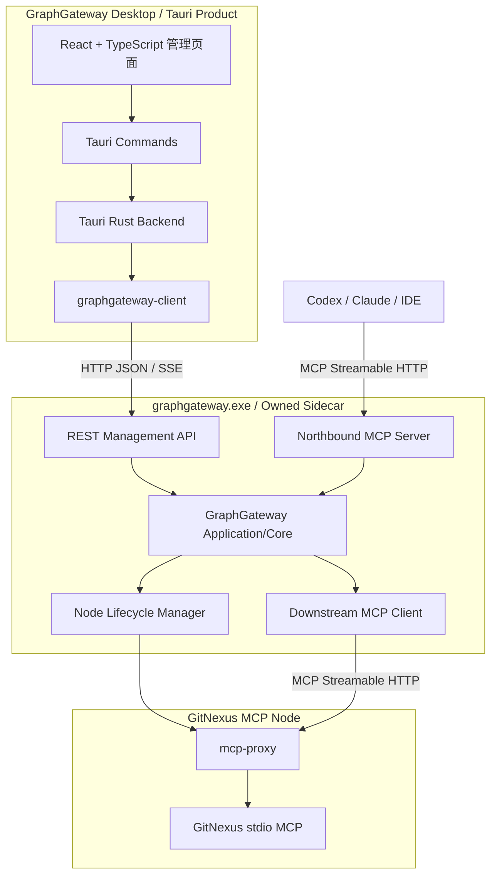
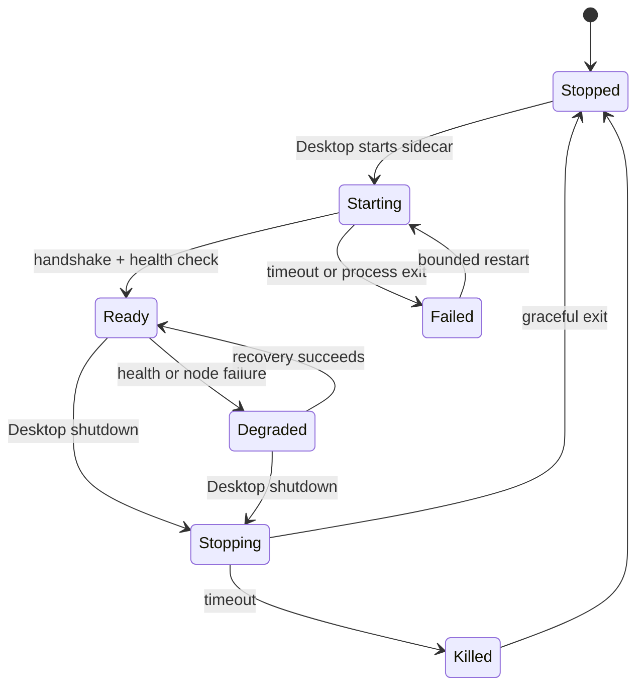

# GraphGateway Windows 与 Tauri Product 设计

> 状态：设计草案
> 目标平台：Windows
> 产品形态：Tauri Desktop + 本地 Owned Sidecar
> 核心实现：Rust
> 关联设计：[Graph Workspace MCP Router 设计](./graph-workspace-mcp-router-design.zh-CN.md)

## 1. 文档范围

本文定义 GraphGateway 在 Windows 平台的实现、产品集成和交付方式，重点覆盖：

- Rust 技术栈与工程边界。
- 独立 `graphgateway.exe`。
- GraphGateway Tauri 管理产品。
- 本地 Owned Sidecar 生命周期。
- REST、MCP 和 CLI 接口分层。
- 本机认证、进程管理、配置、日志和发布。

Graph Workspace、Source、Generation、Resolved Graph View、QueryPlan、一致性和跨仓
路由语义由《Graph Workspace MCP Router 设计》定义，本文不重复定义这些领域模型。

## 2. 已接受的产品决策

1. GraphGateway 核心使用 Rust 实现。
2. 提供可独立运行的 Windows `graphgateway.exe`。
3. 当前项目同时实现正式的 Tauri Product，不将其视为示例程序。
4. Tauri Product 自己实现管理页面，不集成外部产品的前端页面。
5. Tauri Product 通过普通 HTTP JSON API 管理 GraphGateway。
6. AI 客户端继续通过 MCP Streamable HTTP 访问 GraphGateway。
7. CLI 是 REST API 的薄客户端，不为每次查询创建新的 Router 实例。
8. MVP 只实现本地 Owned Sidecar。
9. Tauri Product 不直接链接 `graphgateway-core`，避免使用内部捷径。
10. mcp-proxy 和 GitNexus 保持进程外运行。

## 3. MVP 范围

### 3.1 范围内

- Tauri Product 启动、监控和停止本地 GraphGateway Sidecar。
- GraphGateway REST 管理 API。
- GraphGateway 北向 MCP Streamable HTTP。
- GraphGateway 南向 MCP Streamable HTTP Client。
- Workspace、Source、Generation、Resolved View 和查询管理页面。
- 本地 mcp-proxy 与 GitNexus 子进程生命周期管理。
- 本地访问认证、运行时握手和端口发现。
- CLI 管理与诊断命令。
- Windows 安装包、升级和卸载。
- 日志、健康检查、事件和基础诊断。

### 3.2 暂不实现

- Windows Shared Service 模式。
- Remote GraphGateway 连接模式。
- 团队级用户认证和授权。
- Tauri 进程内 Rust 插件模式。
- C ABI、DLL 或其他进程内插件。
- GraphGateway 自带的 Web Server 管理页面。
- 多个桌面产品共享同一个本地 Sidecar。
- Linux 和 macOS 产品发布。

Shared Service、Remote 和进程内插件是否实现，待 MVP 使用反馈后重新决策。当前代码
不为这些模式预先建立复杂抽象。

## 4. 总体架构



Tauri Product 和 CLI 必须使用公开 REST API。它们不得直接访问 GraphGateway 数据库、
运行时状态或 Router 内部服务。这样桌面产品会持续验证对其他 EXE 开放的集成契约。

## 5. 技术选型

### 5.1 Rust 服务端

| 领域 | 选型 |
|---|---|
| 语言与构建 | Rust stable、Cargo Workspace |
| 异步运行时 | Tokio |
| HTTP Server | Axum、Hyper、Tower |
| HTTP Client | Reqwest |
| MCP | 官方 Rust MCP SDK `rmcp` |
| 序列化 | Serde、serde_json |
| 取消与关闭 | `tokio-util` CancellationToken |
| 领域错误 | thiserror |
| 入口错误报告 | anyhow |
| 状态存储 | SQLite，优先 sqlx |
| 日志 | tracing、tracing-subscriber |
| 指标与 Trace | OpenTelemetry |
| Windows API | `windows` crate |

业务代码通过内部 MCP Adapter 使用 `rmcp`，不在 Domain 和 Application 层传播 SDK
类型。Cargo.lock 必须进入版本控制，SDK 升级需要通过 MCP 合约和互操作测试。

### 5.2 Tauri Product

| 领域 | 选型 |
|---|---|
| Desktop Runtime | Tauri v2 |
| 页面 | React + TypeScript |
| 构建 | Vite |
| 服务端状态 | TanStack Query |
| 后端 HTTP | Reqwest |
| 实时状态 | REST SSE 转换为 Tauri Events |
| Sidecar 打包 | Tauri `externalBin` |

WebView 不直接访问 GraphGateway HTTP endpoint。所有调用经过 Tauri Commands 和
Rust Backend，以避免在前端暴露本地访问令牌，并减少 CORS、CSP 和 localhost
访问面的复杂度。

## 6. Cargo Workspace 与仓库结构

```text
GraphGateway/
├─ Cargo.toml
├─ Cargo.lock
├─ apps/
│  └─ graphgateway-desktop/
│     ├─ package.json
│     ├─ vite.config.ts
│     ├─ src/
│     │  ├─ pages/
│     │  ├─ components/
│     │  ├─ api/
│     │  └─ state/
│     └─ src-tauri/
│        ├─ Cargo.toml
│        ├─ tauri.conf.json
│        ├─ capabilities/
│        ├─ binaries/
│        └─ src/
│           ├─ commands/
│           ├─ sidecar/
│           ├─ events/
│           └─ main.rs
├─ crates/
│  ├─ graphgateway-types/
│  ├─ graphgateway-core/
│  ├─ graphgateway-mcp/
│  ├─ graphgateway-rest/
│  ├─ graphgateway-client/
│  ├─ graphgateway-nodes/
│  ├─ graphgateway-storage/
│  └─ graphgateway-server/
├─ docs/
└─ tests/
   ├─ contract/
   ├─ integration/
   └─ mcp-conformance/
```

依赖方向：

```text
graphgateway-desktop ─→ graphgateway-client ─→ HTTP API

graphgateway-server
    ├─→ graphgateway-rest
    ├─→ graphgateway-mcp
    ├─→ graphgateway-nodes
    ├─→ graphgateway-storage
    └─→ graphgateway-core ─→ graphgateway-types
```

约束：

- `graphgateway-types` 不依赖传输、存储和 Tauri。
- `graphgateway-core` 不依赖 Axum、Reqwest、rmcp 和 Tauri。
- REST 和 MCP 只是 Application/Core 的入站适配器。
- Tauri Product 不依赖 `graphgateway-core`。
- CLI 与 Tauri Backend 复用 `graphgateway-client`。

## 7. 独立 GraphGateway EXE

### 7.1 命令模型

建议使用同一个 `graphgateway.exe` 提供服务端和 CLI：

```text
graphgateway.exe serve
graphgateway.exe validate-config
graphgateway.exe version

graphgateway.exe status --json
graphgateway.exe workspace list --json
graphgateway.exe workspace resolve <workspace-id> --json
graphgateway.exe source list --json
graphgateway.exe source restart <source-id> --json
graphgateway.exe query --workspace <id> --text <query> --json
```

`serve`、`validate-config` 和 `version` 可以离线执行。其余命令默认连接正在运行的
Sidecar REST API。

所有在线 CLI 命令支持：

```text
--endpoint <url>
--token-file <path>
--timeout <duration>
--json
```

CLI JSON 输出是稳定契约；面向人的表格和文本输出不作为机器集成契约。

### 7.2 服务监听

MVP 使用同一个 loopback HTTP Server：

```text
http://127.0.0.1:{port}/api/v1/*
http://127.0.0.1:{port}/mcp
http://127.0.0.1:{port}/healthz
```

规则：

- 只监听 `127.0.0.1`，不监听 `0.0.0.0`。
- 产品首次运行时选择可用端口并持久化，后续优先复用。
- 开发和测试允许使用端口 `0` 获取临时端口。
- 端口被其他进程占用时不得静默连接或终止该进程。
- Sidecar 必须验证 Host、Origin、请求大小和 Content-Type。
- 除最小存活检查外，REST 和 MCP 都要求认证。

## 8. REST 管理接口

### 8.1 设计原则

- 路径使用 `/api/v1` 版本前缀。
- 请求和响应使用 JSON。
- 长时间操作返回 operation ID，进度通过 SSE 发送。
- 列表接口支持分页。
- 修改操作支持幂等键或明确的并发版本。
- API 返回稳定错误码，不要求客户端解析自然语言消息。
- REST 和 MCP 调用必须进入相同的权限、一致性和审计流程。

### 8.2 MVP 接口草案

```text
GET    /api/v1/status

GET    /api/v1/workspaces
POST   /api/v1/workspaces
GET    /api/v1/workspaces/{id}
PUT    /api/v1/workspaces/{id}
DELETE /api/v1/workspaces/{id}
POST   /api/v1/workspaces/{id}/activate
POST   /api/v1/workspaces/{id}/resolve
GET    /api/v1/workspaces/{id}/view

GET    /api/v1/sources
POST   /api/v1/sources
GET    /api/v1/sources/{id}
PUT    /api/v1/sources/{id}
DELETE /api/v1/sources/{id}
GET    /api/v1/sources/{id}/status
POST   /api/v1/sources/{id}/restart

POST   /api/v1/query
POST   /api/v1/context
POST   /api/v1/impact

GET    /api/v1/operations/{id}
DELETE /api/v1/operations/{id}
GET    /api/v1/events

POST   /api/v1/system/shutdown
GET    /healthz
```

具体 DTO 在实现前通过 OpenAPI 或 JSON Schema 固化。REST DTO 不直接序列化领域实体，
防止内部模型演进意外破坏集成契约。

### 8.3 错误模型

```json
{
  "error": {
    "code": "SOURCE_AMBIGUOUS",
    "message": "Multiple sources matched the request.",
    "details": {},
    "trace_id": "01J..."
  }
}
```

Router 设计中定义的稳定错误码在 REST 与 MCP 间保持一致。HTTP 状态码表达传输和
请求类别，`error.code` 表达 GraphGateway 领域错误。

## 9. MCP 接口

北向 MCP endpoint 为：

```text
/mcp
```

它实现 Router 设计中定义的 Workspace 化工具和资源。REST API 不替代 MCP，MCP
也不承担桌面管理页面的通用 CRUD 接口。

REST 和 MCP 响应共享以下语义：

- `workspace_id`
- `view_id`
- `plan_id`
- consistency
- degraded
- member-level provenance
- warnings

MCP SDK 必须隐藏在 `graphgateway-mcp` 内部 Adapter 后。升级 `rmcp` 时至少验证：

- 初始化和能力协商。
- Streamable HTTP Session。
- tools、resources 和 notifications。
- 并发请求与取消。
- 客户端断线和会话回收。
- 与选定 mcp-proxy 的互操作。

## 10. Tauri Product

### 10.1 产品职责

Tauri Product 负责：

- 安装包和桌面入口。
- Sidecar 启动、握手、健康检查和关闭。
- GraphGateway 配置与状态管理页面。
- REST 调用和 SSE 事件展示。
- MCP endpoint 和客户端配置展示。
- 日志和诊断入口。
- Sidecar 与 Desktop 版本兼容检查。

Tauri Product 不负责：

- 执行 QueryPlan。
- 直接管理 mcp-proxy 或 GitNexus。
- 直接读取 GraphGateway SQLite。
- 保存 Router 的内存会话状态。
- 绕过 REST API 修改 Workspace 或 Source。

### 10.2 页面范围

MVP 页面：

1. Overview
   - Sidecar 状态、版本、运行时间和健康摘要。
   - 当前 Workspace、Resolved View 和告警。
2. Workspaces
   - 列表、创建、编辑、删除、激活和解析。
3. Sources
   - 注册信息、角色、endpoint、能力和健康状态。
4. Generations
   - branch、generation、head SHA、freshness 和构建状态。
5. Query Console
   - 调试 `query`、`context` 和 `impact`。
   - 展示 QueryPlan 摘要、provenance、warnings 和耗时。
6. Nodes
   - mcp-proxy、GitNexus 进程和 capability snapshot。
7. Logs & Diagnostics
   - 日志检索、错误、trace ID 和诊断包。
8. Settings
   - 目录、端口、超时、保留策略和日志级别。
9. MCP Setup
   - endpoint、认证说明和客户端配置片段。

页面只依赖 Tauri Commands，不直接 fetch Sidecar。

### 10.3 Tauri Commands

建议保持较薄的 Command 层：

```text
sidecar_status
sidecar_start
sidecar_restart
sidecar_stop

api_get
api_post
api_put
api_delete

open_log_directory
export_diagnostics
```

实际实现可以为高频页面提供强类型命令，但所有命令最终通过
`graphgateway-client` 调用 REST。不得在 Command 中复制 Router 业务规则。

## 11. Owned Sidecar 生命周期

### 11.1 状态机



### 11.2 启动流程

1. Tauri Backend 解析安装目录、数据目录和运行目录。
2. 获取单实例锁，确认没有本产品拥有的 Sidecar 正在运行。
3. 生成本次启动认证材料。
4. 使用 Tauri Sidecar API 启动 `graphgateway.exe serve --owned-sidecar`。
5. 将启动配置通过受控 stdin 或受限运行时文件交给 Sidecar。
6. Sidecar 绑定 loopback 端口并初始化存储。
7. Sidecar 在 stdout 输出一条机器可读的 ready 消息。
8. Tauri Backend 校验 PID、协议版本和 API 版本。
9. 调用 `/healthz` 和 `/api/v1/status`。
10. 健康检查成功后允许页面进入管理状态。

建议 ready 消息：

```json
{
  "type": "ready",
  "protocol_version": 1,
  "pid": 18420,
  "endpoint": "http://127.0.0.1:38470",
  "api_version": "v1",
  "server_version": "0.1.0"
}
```

stdout 用于 Sidecar 控制消息，普通日志写入 stderr 和日志文件，防止握手内容与日志
混杂。

### 11.3 停止流程

1. Tauri Backend 停止创建新 UI 请求。
2. 调用认证后的 `/api/v1/system/shutdown`。
3. Sidecar 拒绝新写请求并等待在途请求完成。
4. 关闭下游 MCP Session。
5. 停止并回收 mcp-proxy 与 GitNexus 子进程。
6. 刷新状态并退出。
7. 超过关闭预算后，Tauri 终止 Windows Job Object。

禁止仅杀死直接子进程而留下 mcp-proxy 或 GitNexus 孤儿进程。

### 11.4 异常恢复

- Sidecar 意外退出时，页面进入不可用状态并显示退出码。
- 保存最近 stderr、日志路径和 crash context。
- 使用有上限的指数退避重启。
- 短时间连续失败达到阈值后停止自动重启。
- 不对数据迁移失败和配置校验失败进行无限重启。
- 恢复后重新拉取完整状态，不复用旧 SSE 或旧会话。

## 12. Windows 子进程管理

Tauri Product 创建一个 Windows Job Object，并将 `graphgateway.exe` 加入该 Job。
GraphGateway 创建的 mcp-proxy 和 GitNexus 进程必须继承或加入相同的进程树约束。

至少启用：

- Parent/Desktop 退出时终止 Job。
- 限制不受控的子进程逃逸。
- 记录 PID、启动时间、退出码和 stderr。
- 优雅关闭优先，强制终止作为最后手段。

Node Manager 负责：

- 参数安全构造，不通过 Shell 拼接命令。
- 独立 stdout 协议和 stderr 日志。
- 启动超时、健康检查和退出监控。
- generation 蓝绿实例引用计数。
- 闲置实例回收。
- 进程数量与资源上限。

## 13. 本机认证与安全

### 13.1 认证

Tauri Backend 生成或读取本机访问凭据，并通过安全启动通道传给 Sidecar。前端页面
不得获取明文 token。

REST 和 MCP 使用：

```text
Authorization: Bearer <local-token>
```

AI 客户端所需的 MCP 凭据由 MCP Setup 页面显式展示或写入用户批准的配置位置，不在
普通日志中输出。

### 13.2 本机 HTTP 边界

- 仅允许 loopback。
- 校验 Host 和 Origin。
- 对 JSON、SSE 和 MCP 设置请求与响应大小上限。
- 对写接口启用 CSRF/Origin 防护。
- 限制重定向和下游 endpoint 允许列表。
- 不信任“来自 localhost”本身足以代表合法调用者。
- `/healthz` 只返回最少信息，不泄露 Workspace、路径和版本细节。

### 13.3 文件权限

运行时描述、token、SQLite 和敏感配置只允许当前 Windows 用户访问。安装目录与数据
目录分离，避免自动升级覆盖用户数据。

## 14. 配置、数据与日志

建议目录：

```text
%LOCALAPPDATA%\GraphGateway\
├─ config/
│  └─ graphgateway.toml
├─ data/
│  └─ graphgateway.db
├─ graphs/
├─ logs/
├─ cache/
└─ run/
```

安装资产：

```text
<install-dir>\
├─ GraphGateway Desktop.exe
├─ graphgateway.exe
├─ mcp-proxy.exe
└─ resources/
```

规则：

- 配置、数据库、图谱和日志不放入安装目录。
- 运行时临时文件放入 `run`，正常退出后清理。
- 日志默认滚动并设置容量上限。
- 日志不得记录 token、完整 Authorization Header 或未经裁剪的源码。
- 升级前备份需要迁移的数据库。
- 数据库 schema 迁移必须可检测、可审计并在失败时停止启动。

## 15. SSE 与桌面事件

Tauri Rust Backend 订阅：

```text
GET /api/v1/events
```

然后转换为受控的 Tauri Events：

```text
graphgateway://sidecar-state
graphgateway://workspace-changed
graphgateway://source-health
graphgateway://generation-progress
graphgateway://operation-progress
graphgateway://warning
```

事件只用于状态更新提示，页面收到事件后通过 TanStack Query 失效对应缓存并重新读取
权威 REST 状态。不得依赖事件流重建全部业务状态。

断线时：

- 显示连接状态。
- 使用退避重新订阅。
- 重新连接后执行完整状态刷新。
- 不假定丢失期间没有状态变化。

## 16. 版本与兼容性

需要区分：

- Desktop 产品版本。
- Sidecar Server 版本。
- REST API 版本。
- Sidecar 启动协议版本。
- MCP 协议版本。
- Workspace 配置 schema 版本。
- SQLite schema 版本。

启动握手时，Desktop 必须验证 Sidecar 启动协议和 REST API 是否兼容。不兼容时停止
使用该 Sidecar，并提示修复或升级，不能带着未知契约继续运行。

同一安装包内 Desktop 和 Sidecar 使用相同产品版本。REST `/api/v1/status` 返回完整
兼容信息，但不将 Cargo crate 版本当作公共 API 版本。

## 17. 安装、升级与卸载

### 17.1 安装包

Tauri 安装包包含：

- Desktop executable。
- `graphgateway.exe` Sidecar。
- 已选定的 mcp-proxy。
- 必需资源、默认配置模板和许可证。

GitNexus 的具体打包方式在验证其运行时依赖后确定，但必须由 Node Manager 通过明确
路径启动，不依赖用户全局 PATH。

### 17.2 升级

1. 阻止新的管理操作。
2. 优雅停止 Sidecar 和节点进程。
3. 替换安装资产。
4. 保留用户配置和数据。
5. 启动新 Sidecar。
6. 执行兼容性检查和必要的数据迁移。
7. 健康检查成功后进入正常页面。

如果升级失败，应保留诊断信息，不应删除旧数据。是否实现二进制版本回滚由安装器
方案单独决定。

### 17.3 卸载

卸载程序默认移除应用和二进制，不自动删除用户图谱、配置和日志。删除用户数据必须
作为显式选项，并清楚展示目标路径。

## 18. 测试策略

### 18.1 单元测试

- Workspace 与 Source 校验。
- QueryPlan 生成。
- 一致性门禁。
- REST DTO 映射。
- 错误码映射。
- Sidecar 状态机。
- CLI 参数和 JSON 输出。

### 18.2 合约测试

- REST OpenAPI/JSON Schema。
- MCP tools 和 resources schema。
- ready 握手协议。
- Desktop 与 Sidecar 版本兼容矩阵。
- CLI JSON 输出。

### 18.3 集成测试

- Tauri Backend 启动真实 Sidecar。
- 动态端口、认证和健康检查。
- mcp-proxy + GitNexus stdio 启动。
- MCP 初始化、能力协商和查询。
- Sidecar 优雅关闭。
- Desktop 崩溃后的 Job Object 回收。
- Sidecar 崩溃和有界重启。
- generation 蓝绿切换。
- 日志滚动和敏感信息裁剪。

### 18.4 端到端测试

- 从页面创建 Source 和 Workspace。
- 解析 Resolved View。
- 从 Query Console 执行查询。
- 从外部 MCP Client 执行相同查询。
- 比较 REST 与 MCP provenance 和错误语义。
- 打包后的 Windows 安装、升级和卸载。

## 19. 分阶段实施

### 阶段一：工程骨架与 Sidecar

- Cargo Workspace 和 crate 边界。
- `graphgateway.exe serve`。
- Axum loopback Server。
- Sidecar ready 握手。
- Tauri Product 骨架。
- Sidecar 启停、健康检查和 Job Object。
- `/healthz`、`/api/v1/status`。

### 阶段二：管理控制面

- SQLite 和配置。
- Workspace 与 Source REST API。
- `graphgateway-client`。
- Workspace、Source、Settings 页面。
- SSE 与 Tauri Events。
- CLI 在线管理命令。

### 阶段三：MCP 与单源路由

- 北向 `rmcp` Server。
- 南向 `rmcp` Client。
- mcp-proxy/GitNexus Node Manager。
- capability snapshot。
- generation 解析。
- `query`、`context`、`impact` 单源路由。
- Query Console、Nodes 和 Generations 页面。

### 阶段四：可靠性与交付

- 超时、重试、熔断和取消。
- generation 蓝绿切换与旧实例回收。
- 日志、trace 和诊断包。
- 安装、升级和卸载。
- 合约、互操作和端到端测试。

多源查询、dependency binding 和微服务协作继续按 Router 设计中的阶段推进，但不改变
本文确定的 Desktop、REST、MCP 和 Sidecar 边界。

## 20. 待验证事项

进入实现前需要用最小原型验证：

1. `rmcp` Streamable HTTP Client 与候选 mcp-proxy 的互操作。
2. `rmcp` Streamable HTTP Server 与目标 AI 客户端的互操作。
3. Tauri `externalBin` 在 Windows 安装包中的路径、签名和升级行为。
4. Tauri Sidecar stdin/stdout ready 握手。
5. Windows Job Object 对完整后代进程树的回收。
6. GitNexus stdio stdout 与 stderr 隔离。
7. mcp-proxy Session 到 GitNexus 进程的映射和并发安全。
8. 本机 token 的生成、存储和向 MCP 客户端配置的交付方式。
9. 首次端口选择、持久化和冲突恢复。
10. SQLite schema 迁移与安装器升级流程。

验证结果应形成 ADR 或测试报告。若验证推翻某项技术假设，应优先调整适配层，不改变
Workspace、Resolved View 和 QueryPlan 的核心模型。

## 21. 关键决策

1. Rust 是 GraphGateway 与 Tauri Product 的共同实现语言。
2. GraphGateway Core 与 Tauri 解耦。
3. Tauri Product 是正式交付物，不是示例或临时调试工具。
4. MVP 只支持本地 Owned Sidecar。
5. Tauri Product 通过公开 REST API 使用 GraphGateway。
6. WebView 不直接访问 Sidecar。
7. CLI 与 Tauri Backend 复用 `graphgateway-client`。
8. REST 服务产品管理，MCP 服务 AI 客户端。
9. Sidecar 和所有节点子进程受 Windows Job Object 管理。
10. mcp-proxy 和 GitNexus 保持进程外。
11. 当前不实现 Windows Service、Remote 或 DLL 模式。
12. 公开协议和运行时状态必须带版本并进行兼容性检查。
