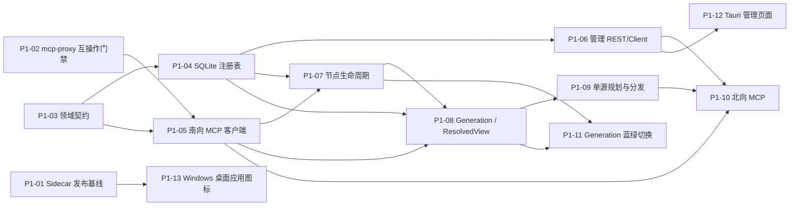

# GraphGateway 下一阶段任务卡

## 规划基线

- 设计来源：`docs/graph-workspace-mcp-router-design.zh-CN.md`
- 产品约束补充：`docs/graphgateway-windows-tauri-product-design.zh-CN.md`
- 规划分支：`mcp`
- 规划时 HEAD：`b968560d8f3727a85e39d6448a9aeb95937645f5`
- Git 状态：干净，分支与 `origin/mcp` 一致
- 基线验证：`cargo test --workspace --all-features` 通过
- 默认执行器：Claude Code
- 当前模式：Plan only；本目录只定义任务，不代表已调度或已实现

## 状态与调度规则

所有任务卡初始状态均为 `DRAFT`。任务卡本身尚未提交，因此不能把规划时
HEAD 当作执行基线。控制器提交本目录后，应按以下规则调度：

1. 将第一波任务卡的 `Expected HEAD` 替换为“任务卡提交”的完整 40 位 SHA，
   再将其状态改为 `READY`。
2. 后续任务只能基于其依赖项已集成后的完整 SHA 调度；不得用分支名、
   `HEAD`、短 SHA 或工作区猜测基线。
3. 每张卡限一次主实现和最多两轮整改。第二轮仍未达到验收标准时，停止继续
   补丁，返回 `BLOCKED` 并说明需重新设计或拆卡的原因。
4. Claude Code 必须在独立 worktree/分支执行，且只修改任务卡允许范围。
5. 返回结果必须包含：状态、完整提交 SHA、变更文件、验证命令与结果、
   未完成项/风险；不得只返回自然语言“已完成”。

## 依赖关系

`P1-01` 是发布工程的独立支线，不阻塞路由内核，但在 Windows 交付验收前必须
完成。`P1-02` 是架构门禁：若标准 MCP 链路不能提供设计要求的 generation
能力，`P1-05` 可以实现通用 MCP 客户端，但 `P1-08` 必须返回 `BLOCKED`，
禁止私自使用 mcp-proxy 私有接口或伪造 generation 语义。

## 建议执行波次

| 波次 | 可并行任务 | 进入条件 |
| --- | --- | --- |
| A | P1-01、P1-02、P1-03 | 任务卡已提交并写入准确 Expected HEAD |
| B | P1-04、P1-05 | P1-03 已集成；P1-05 还要求 P1-02 已通过 |
| C | P1-06、P1-07 | P1-04 已集成；P1-07 还要求 P1-05 已集成 |
| D | P1-08、P1-12、P1-13 | 各自依赖已集成；三者可并行 |
| E | P1-09、P1-11 | P1-08 已集成；两者可并行 |
| F | P1-10 | P1-05、P1-06、P1-09 已集成 |

## 任务清单

| ID | 文件 | 交付物 |
| --- | --- | --- |
| P1-01 | `GGW-P1-01-sidecar-release-baseline.md` | Windows Owned Sidecar 可重复构建和打包基线 |
| P1-02 | `GGW-P1-02-mcp-proxy-interop-gate.md` | mcp-proxy/GitNexus 标准 MCP 互操作证据 |
| P1-03 | `GGW-P1-03-domain-contracts.md` | Workspace/Source/Generation/ResolvedView 领域契约 |
| P1-04 | `GGW-P1-04-sqlite-registry.md` | SQLite 配置与注册表 |
| P1-05 | `GGW-P1-05-southbound-mcp-client.md` | 南向标准 MCP 客户端与能力协商 |
| P1-06 | `GGW-P1-06-management-rest-client.md` | Workspace/Source 管理 REST 与 Rust Client |
| P1-07 | `GGW-P1-07-node-lifecycle.md` | proxy/GitNexus 节点生命周期与能力注册 |
| P1-08 | `GGW-P1-08-generation-resolved-view.md` | generation 解析及不可变 ResolvedGraphView |
| P1-09 | `GGW-P1-09-single-source-routing.md` | 单源 QueryPlan、一致性门禁、分发和 provenance |
| P1-10 | `GGW-P1-10-northbound-mcp.md` | 北向 Streamable HTTP MCP 单源垂直链路 |
| P1-11 | `GGW-P1-11-generation-blue-green.md` | generation 蓝绿切换和安全回收 |
| P1-12 | `GGW-P1-12-tauri-management-pages.md` | Tauri Workspace/Source 管理页面 |
| P1-13 | `GGW-P1-13-desktop-icon.md` | Windows 桌面图标设计、深浅色适配与 Tauri 接入 |

## 本阶段明确不做

- 多 Source fan-out、跨仓图合并、跨源排序与冲突消解
- Remote Shared Service、In-process Library 两种部署模式
- WebView 直接访问 GraphGateway REST，或 Tauri 直接依赖路由内部 crate
- 绕过标准 MCP 调用 mcp-proxy 私有控制接口
- 自动发现任意仓库、云端账号体系、远程多租户和公网暴露
- 在没有能力证据时承诺 GitNexus generation/写工具语义
